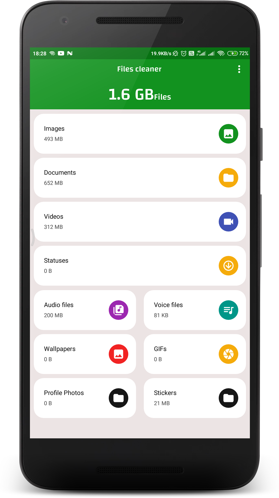
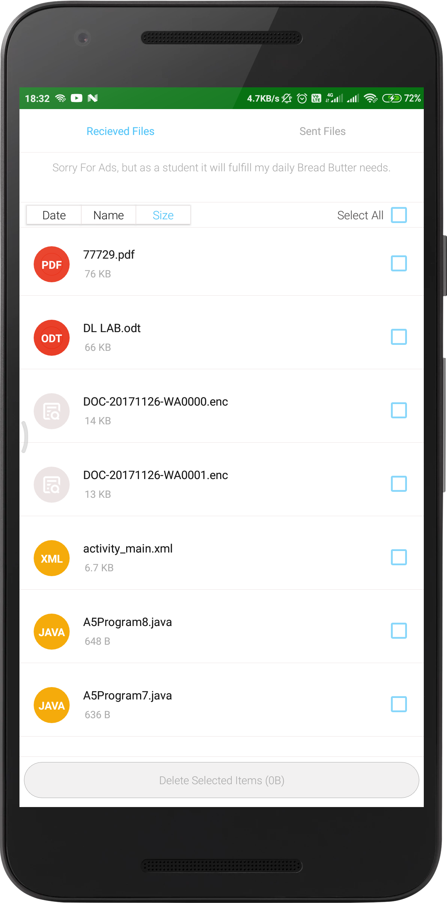
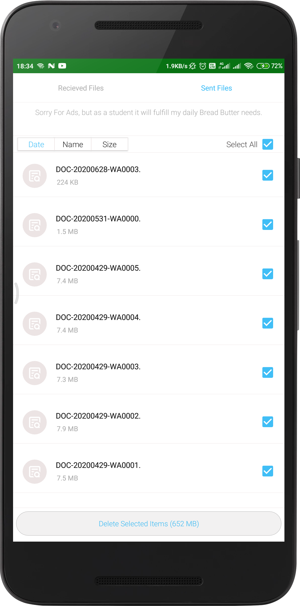
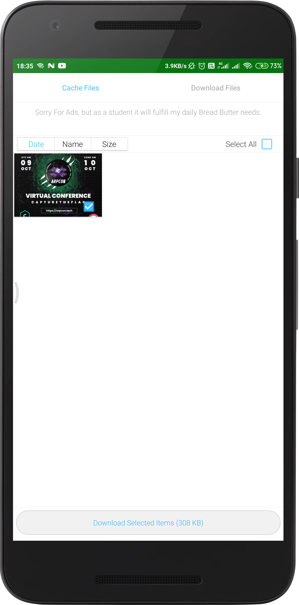

# WhatsApp-Cleaner 
This app is the powerful tool to clean and backup received and sent media via WhatsApp. 

## Features

  * [x] All WhatsApp Media in the same place
  * [x] Delete a specified WhatsApp media file (image, video, status, audio, voice note, document...) or all media files by an easy click
  * [x] Status saver and cleaner.
  * [x] Preview the sent and received media separately.
  * [x] High-quality design and a user-friendly interface.

### Show some :heart: and star the repo to support the project

## Screenshots

### HomeScreen

### Documents Section

### Delete Your Files

### Download Your Statuses

## Contribution Guidelines
Any kind of contribution to the project is highly welcomed, we encourage all participants new to open source to give it a try. Any one willing to contribute to this particular project must follow the contribution for cleanliness, easy to read and smooth working of the project, 
1. Raise an issue before you make a pr. 
2. Changes should be pushed in the **development** branch. 
3. Squash all your commits in to a single commit before creating a pull request. 
4. If the pr for the issue isn't raised within 2 weeks, the issue can be assigned to another person. 

# Pull Requests

We welcome and encourage all pull requests. It usually will take us within 24-48 hours to respond to any issue or request. Here are some basic rules to follow to ensure timely addition of your request:

1.  Match coding style (braces, spacing, etc.) This is best achieved using `Reformat Code` feature of Android Studio `CMD`+`Option`+`L` on Mac and `CTRL` + `ALT` + `L` on Linux + Windows .
2.  If its a feature, bugfix, or anything please only change code to what you specify.
3.  Please keep PR titles easy to read and descriptive of changes, this will make them easier to merge :)
4.  Pull requests _must_ be made against `develop` branch. Any other branch (unless specified by the maintainers) will get rejected.
5.  Check for existing [issues](https://github.com/Pawan0411/WhtasApp-Cleaner/issues) first, before filing an issue.
6.  Make sure you follow the set standard as all other projects in this repo do
7.  Have fun!
